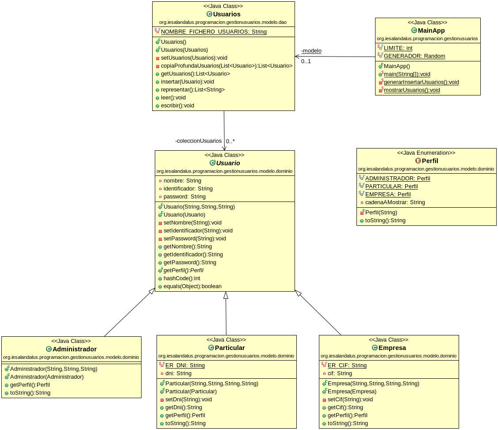

Tu tarea consiste en implementar una aplicación para la gestión de usuarios que luego será utilizada para acceder a otra aplicación. La idea es que tendremos unos datos genéricos para los usuarios y dependiendo del perfil tendrán otros:

- Para un usuario se quiere guardar su nombre, su identificador y su password.
- Si el perfil es **Administrador** no necesitaremos ningún dato adicional.
- Si el perfil es **Particular** también queremos almacenar su DNI.
- Si el perfil es **Empresa** también queremos guardar el CIF.

Además queremos que todos los usuarios se guarden en una lista y también en ficheros.

La aplicación comenzará leyendo el fichero de usuarios, los mostrará por pantalla, generará un nuevo usuario de cada tipo (Administrador, Particular y Empresa) rellenando con datos aleatorios los campos y los insertará en la lista, mostrará otra vez la lista de usuarios y finalmente guardará los usuarios en el fichero.

Para ello te recomiendo que sigas los siguientes pasos.

- El diagrama de clases que debes implementar es el siguiente:

- En el siguiente repositorio: [repositorio GitHub esqueleto tarea](https://github.com/andresrubiodelrio/GestionUsuarios) encontrarás un esqueleto de la aplicación gradle y las pruebas para las clases de dominio del modelo comentadas que deberás descomentar para poder ejecutarlas.
- **(4 puntos)** Implementa correctamente la jerarquía de clases dada para los objetos del dominio. En todos los métodos en los que se pase algún valor null se deberá comprobar y lanzar la excepción `NullPointerException`. También deberás comprobar que los valores son correctos utilizando expresiones regulares para el DNI y el CIF o que no estén vacíos en los demás casos y en caso contrario lanzar la excepción `IllegalArgumentException`. Consideramos que dos usuarios son iguales si su identificador es el mismo.
- **(3 puntos)** Implementa correctamente la clase dao `Usuarios`. Debes gestionar los datos mediante una lista (ArrayList) de usuarios (polimórficos). Tendrá su constructor por defecto y su constructor copia. El método `getUsuarios` devolverá una copia profunda de la lista de usuarios. El método `insertar` añadirá el objeto a la lista si este no existe y no es nulo. El método `representar` simplemente devolverá una lista de cadenas con la representación de cada uno de los objetos. Ten en cuenta el problema del alisasing.
- **(2 puntos)** Haz que la clase dao `Usuarios` también permita escribir la lista de usuarios en un fichero y que permita leer el fichero y almacenar en la lista los objetos contenidos en dicho fichero. Haz los cambios necesarios también en las clases de dominio que consideres adecuadas. A los ficheros accederás mediante su ruta relativa.
- **(1 punto)** Crea la aplicación principal tal y como se muestra en el diagrama de clases. Debes apoyarte en los métodos auxiliares que se especifican.

###### Se valorará:

- La nomenclatura del repositorio de GitHub y del archivo entregado sigue las indicaciones de entrega.
- La indentación debe ser correcta en cada uno de los apartados.
- El nombre de las variables debe ser adecuado.
- Se debe utilizar la clase Entrada para realizar la entrada por teclado.
- El proyecto debe pasar todas las pruebas que van en el esqueleto del mismo y toda entrada del programa será validada para evitar que el programa termine abruptamente debido a una excepción.
- Se deben utilizar los comentarios adecuados.
- Se valorará la corrección ortográfica tanto en los comentarios como en los mensajes que se muestren al usuario.
